# vaccination_managment_app

A simple mobile application to help users manage their vaccination records. The
application will allow users to track their vaccination history, schedule upcoming vaccinations, and receive reminders for upcoming doses. The application is connected to a django backend with a MySQL database to store and manage user vaccination data securely.

## Views and Functionalites

1. **Login and Registration**: Users can create an account and login to the application. The application will store user data securely in the database. After successful login acces and refresh tokens are stored in the application. The application every 3 seconds checks if the access token is still valid and if not it refreshes it. If refresh token is expired user is logged out and has to log in again.
   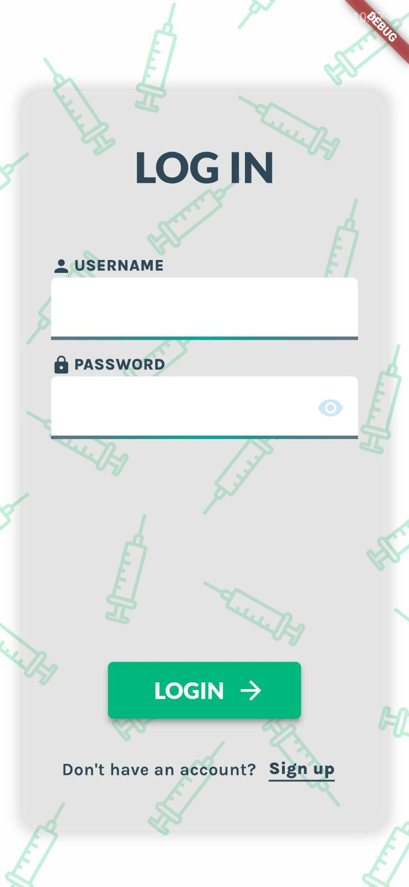
   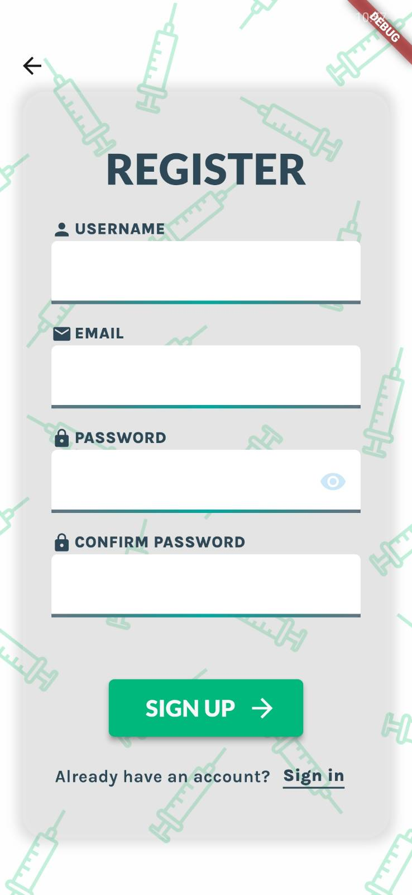

2. **Home Screen**: After first installation of the app it asks about access to the push notifications. The home screen has buttons to navigate to different views in the application.
   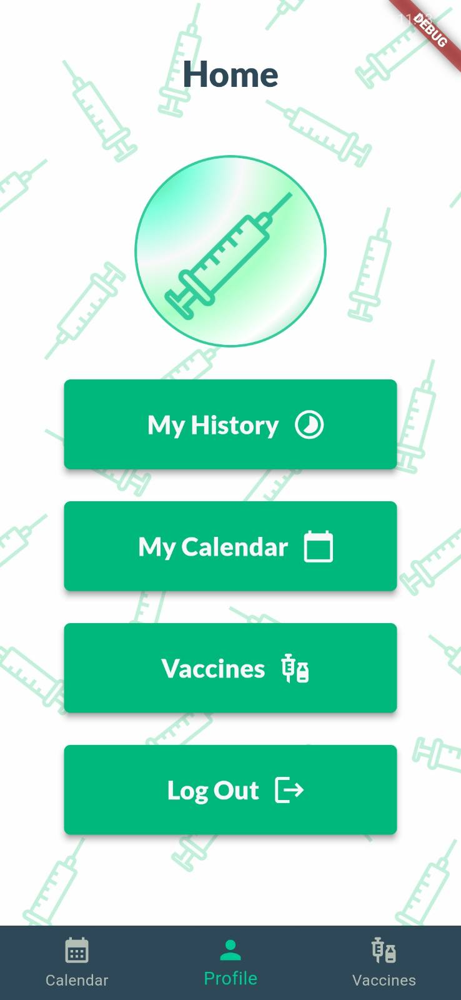

3. **Available Vaccines**: Users can view a list of available vaccines excluding these user has already in the history. The list is fetched from the backend and displayed in the application. After tapping on a vaccine, the user can view more details about the vaccine and schedule vaccination. If vaccine has more than 1 dose, backend will automatically schedule next doses.

   Vaccines with "!" symbol are obligatory, with "r" symbol are recommended and with "o" symbol are optional.
   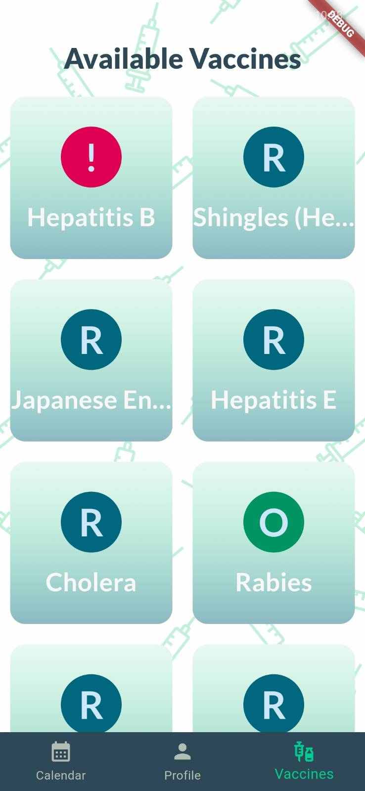
   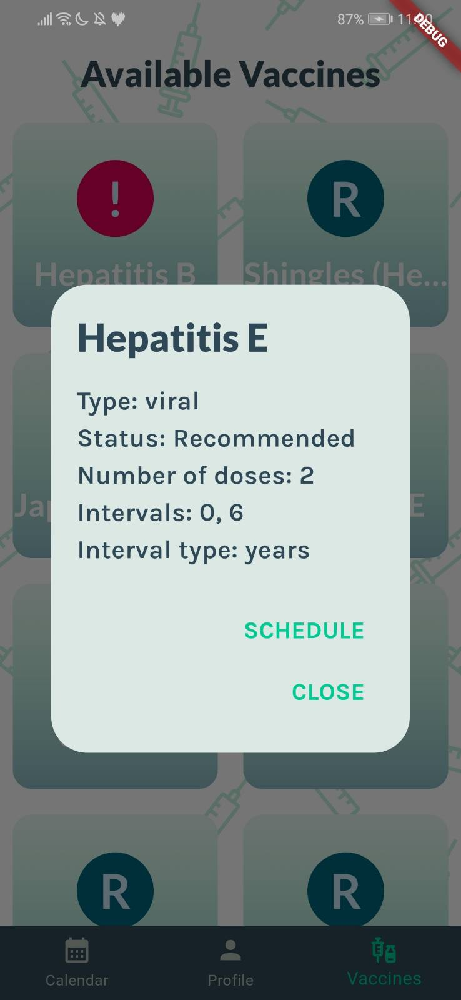
   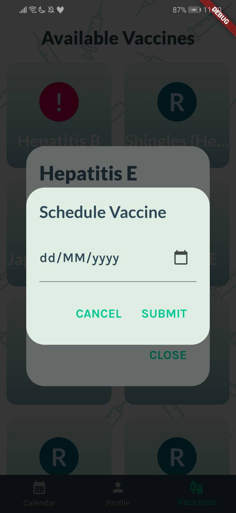
   
   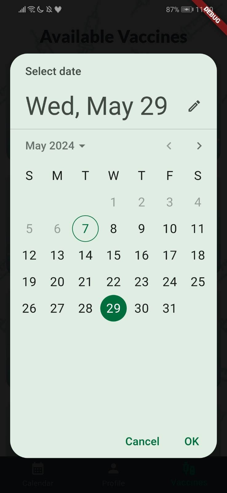
   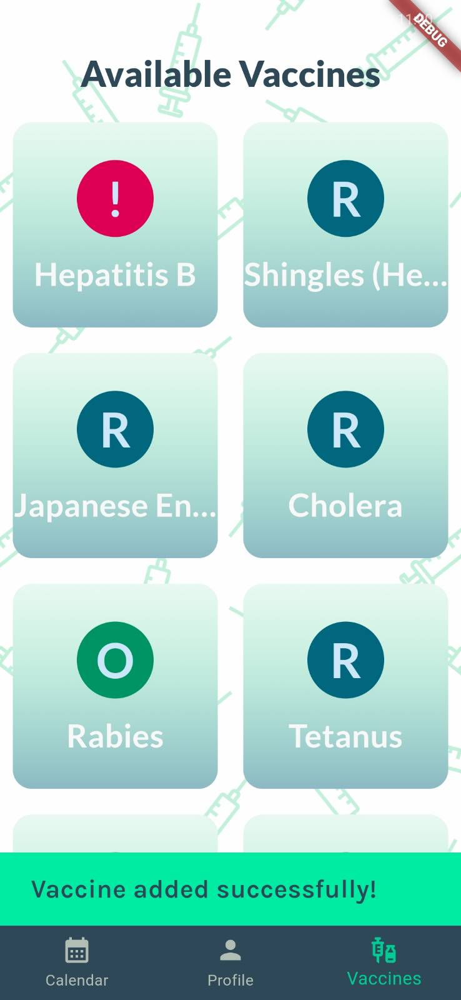

4. **Vaccination History**: Users can view their vaccination history in the application. After tapping on a vaccine, the user can view more details about the vaccination record. Records with "C" symbol are canceled, with "P" symbol are pending and with "D" symbol are done.
   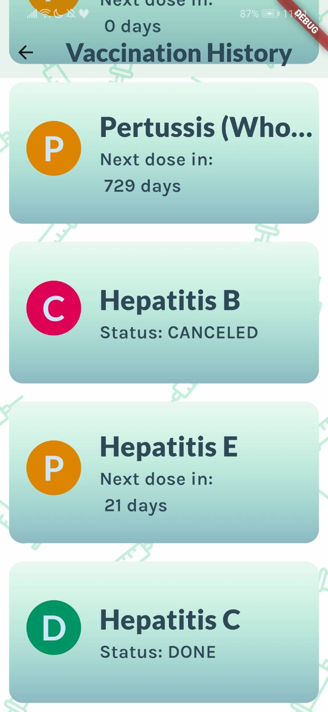
   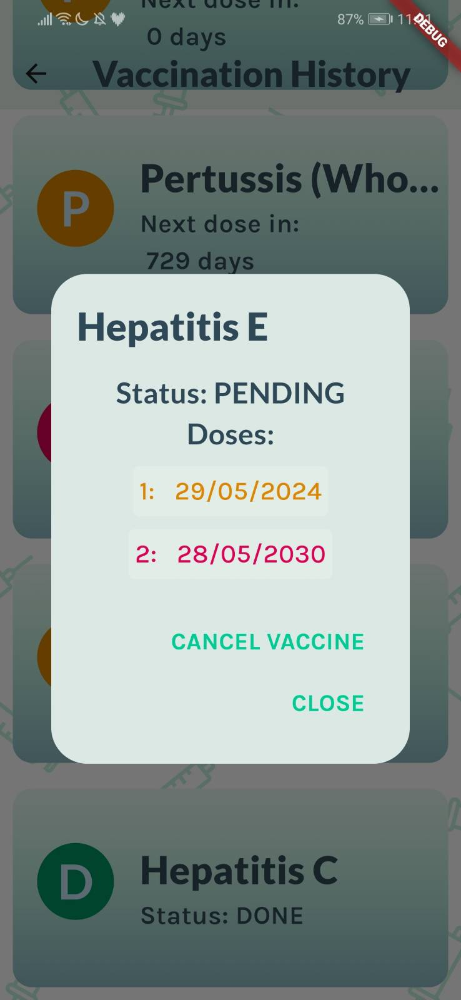

   In the details user can cancel vacicne or after pressing on dose date can reschedule them or mark as done. Dates marked with green color are already taken, with orange are pending and with red are next pending doses.

   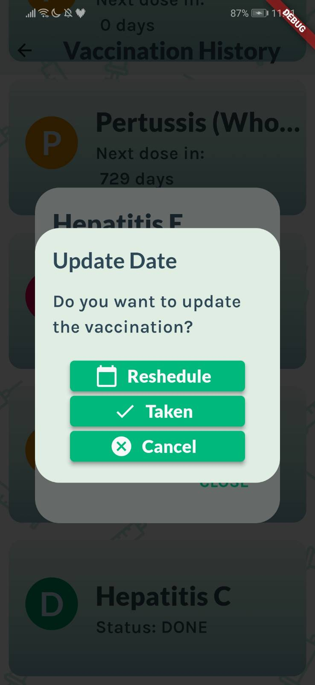

   After taking date from calendar there is a confirmation screen.

   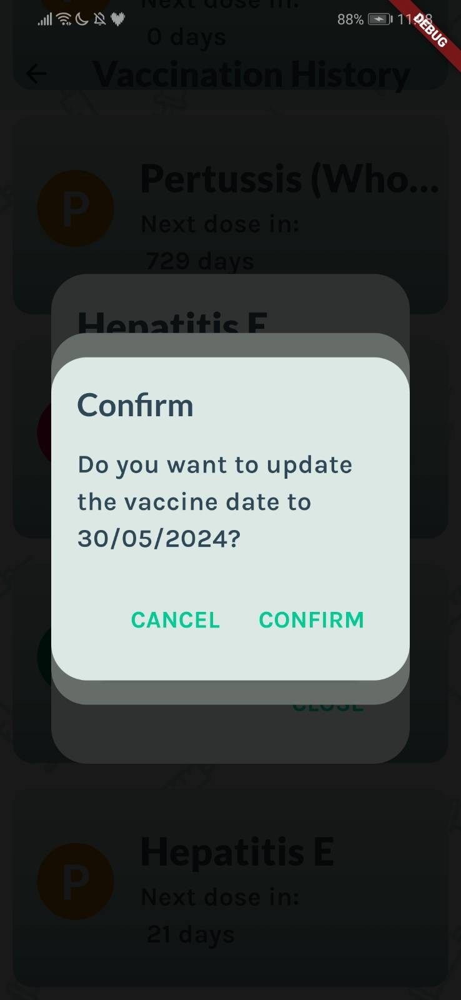
   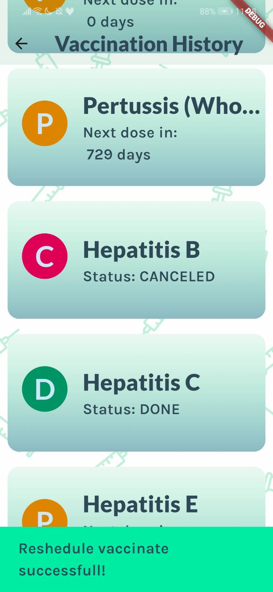

   After successful rescheduling user gets snackbar.

5. **Calendar**: Users can view a calendar with their scheduled vaccinations. Green fields are days when vaccination was taken, orange one means pending and red means next pending dose. Canceled vaccinations aren't displayed. The user can tap on a date to view the scheduled vaccination for that date and mark it as taken.
   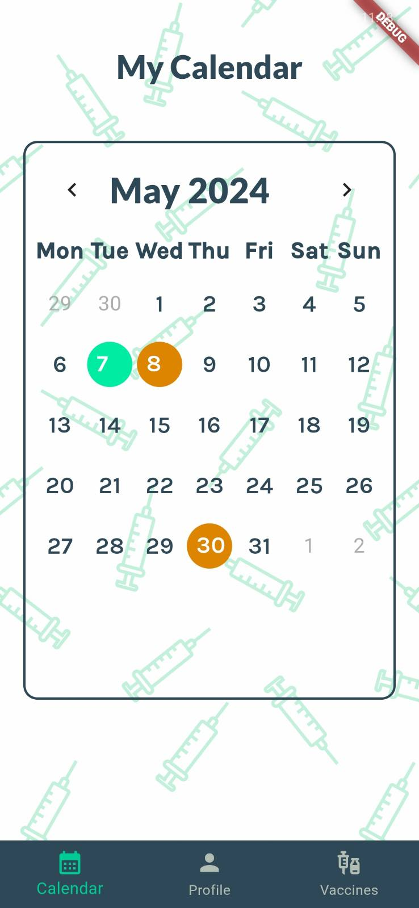
   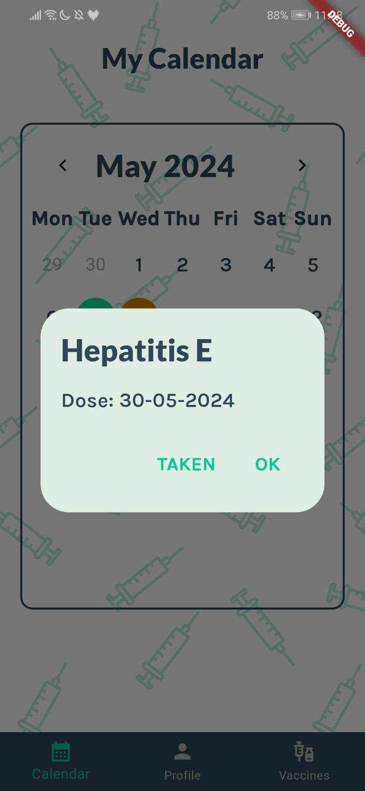
   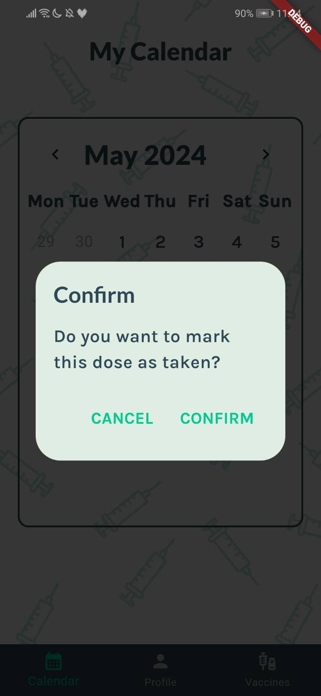
   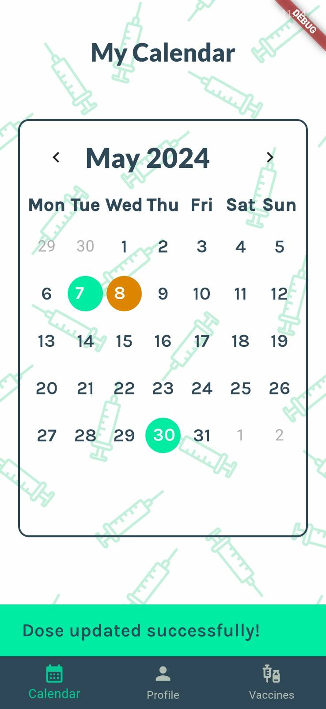
